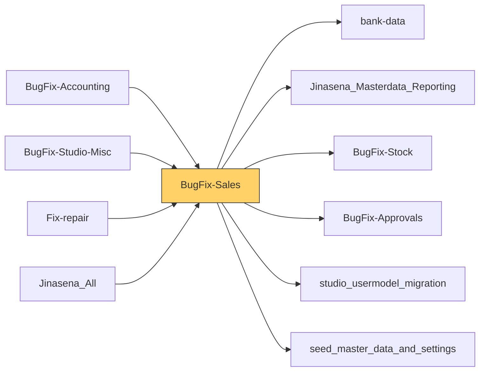

# Functional Documentation — BugFix-Sales

> Generated by `scripts/generate_functional_docs.py` from branch `Visual_Migration_02` (commit 66c1ca4 2026-10-06) and the installed module on the clean environment. For every attribute: **Function** = what it does, **Depends on** = the attributes it relies on (owning module in brackets when it is not this repo), **Used by** = the attributes in any Jinasena repo that rely on it.

| Item | Value |
|---|---|
| Technical name | `BugFix-Sales` |
| Title | Jinasena : Module : Sales |
| Version | `17.0.1.0.165` |
| Category | Sales |
| License | LGPL-3 |
| Installed on environment | installed 17.0.1.0.165 |
| History | [CHANGELOG.md](CHANGELOG.md) |

## Purpose

<!-- SUMMARY:repo -->
BugFix-Sales is the Jinasena Sales module. It carries the company's sales-side customisations that were first built in Odoo Studio and are now shipped as code: the rules sales staff follow when quoting and confirming orders for ordinary Sales, Project and Repair quotations, the customer master-data controls behind credit sales, and the per-company sales settings used by this module and by Fix-repair. It is used by salespeople, sales approvers, project and repair staff, and administrators who maintain sales configuration.

- Sales order approvals: request and approve buttons with seven approval rules for credit limit, temporary credit, overdue balances, bank guarantee, margin, over-commission and customer payment creation.
- Quotation types (Sales, Project, Repair): automations that set the type from the linked task or project, apply the project price list, add a _PRJ suffix to project order numbers, track repair lock and re-estimate status and handle Repair-Under-Guarantee (RUG) approval and pricing.
- Project quotations: stock and cost details per line, creating purchase requests, pulling RFQ costs back, and creating project budgets.
- Order line controls: discount, commission and margin checks, pricelist application and sales report type.
- Customer controls: payment type, credit limit and bank guarantee validation, payment term defaults from customer and vendor groups, and chatter tracking of key contact changes.
- Product item approval requests and import split-method checks.
- Sales Configurations in Settings (minimum margin %, advance payment %, quotation validity, last purchase price validity), Delivery Terms, and reusable introduction and conclusion texts for printed quotations.
<!-- /SUMMARY -->

## Module dependencies

| Kind | Modules |
|---|---|
| Odoo standard / enterprise | `base_setup`, `sale`, `sale_stock`, `industry_fsm_sale`, `purchase_requisition`, `website_sale`, `sale_subscription`, `sale_loyalty`, `account_followup`, `base_automation` |
| Jinasena repos | `bank-data`, `Jinasena_Masterdata_Reporting`, `BugFix-Stock`, `BugFix-Approvals`, `studio_usermodel_migration`, `seed_master_data_and_settings` |
| Third-party apps |  |
| Used by (Jinasena repos that depend on this one) | `BugFix-Accounting`, `BugFix-Studio-Misc`, `Fix-repair`, `Jinasena_All` |

## Contents at a glance

| Attribute type | Count |
|---|---|
| Models created | 5 |
| Models extended | 20 |
| Fields | 326 |
| Python methods | 22 |
| Views | 41 |
| Window actions | 52 |
| Server actions | 178 |
| Automations | 69 |
| Approval rules | 7 |
| Menus | 13 |
| Access rights | 19 |
| Record rules | 25 |
| Install hooks | 4 |
| Migration scripts | 9 |

## Models

Each model has its own page (the full reference is too large for one GitHub page).

| Model | Description | Created / extends | Fields | Views | Actions + automations | Approvals |
|---|---|---|---|---|---|---|
| [`account.payment`](functional_docs/account.payment.md) | account.payment | extends (account) | 2 | 0 | 0 | 0 |
| [`bugfix_sales.doc_conclusion`](functional_docs/bugfix_sales.doc_conclusion.md) | Quotation Document Conclusion | created | 10 | 2 | 0 | 0 |
| [`bugfix_sales.doc_intro`](functional_docs/bugfix_sales.doc_intro.md) | Quotation Document Introduction | created | 10 | 2 | 0 | 0 |
| [`bugfix_sales.minimum_sales_margin.seed`](functional_docs/bugfix_sales.minimum_sales_margin.seed.md) | Seed Minimum Sales Margin config per company | created | 0 | 0 | 0 | 0 |
| [`product.category`](functional_docs/product.category.md) | Product Category | extends (product) | 0 | 0 | 2 | 0 |
| [`product.packaging`](functional_docs/product.packaging.md) | Product Packaging | extends (product) | 0 | 0 | 0 | 0 |
| [`product.pricelist`](functional_docs/product.pricelist.md) | Pricelist | extends (product) | 4 | 2 | 3 | 0 |
| [`product.pricelist.item`](functional_docs/product.pricelist.item.md) | Pricelist Rule | extends (product) | 1 | 0 | 0 | 0 |
| [`product.product`](functional_docs/product.product.md) | Product Variant | extends (product) | 43 | 4 | 7 | 0 |
| [`product.replenish`](functional_docs/product.replenish.md) | Product Replenish | extends (stock) | 0 | 0 | 0 | 0 |
| [`product.template`](functional_docs/product.template.md) | Product | extends (product) | 15 | 4 | 17 | 0 |
| [`res.company`](functional_docs/res.company.md) | Companies | extends (base) | 4 | 1 | 0 | 0 |
| [`res.config.settings`](functional_docs/res.config.settings.md) | Config Settings | extends (base) | 4 | 1 | 0 | 0 |
| [`res.partner`](functional_docs/res.partner.md) | Contact | extends (base) | 5 | 3 | 73 | 0 |
| [`sale.advance.payment.inv`](functional_docs/sale.advance.payment.inv.md) | Sales Advance Payment Invoice | extends (sale) | 1 | 1 | 0 | 0 |
| [`sale.mass.cancel.orders`](functional_docs/sale.mass.cancel.orders.md) | Cancel multiple quotations | extends (sale) | 0 | 0 | 0 | 0 |
| [`sale.order`](functional_docs/sale.order.md) | Sales Order | extends (sale) | 107 | 8 | 112 | 7 |
| [`sale.order.alert`](functional_docs/sale.order.alert.md) | Sale Order Alert | extends (sale_subscription) | 4 | 0 | 0 | 0 |
| [`sale.order.cancel`](functional_docs/sale.order.cancel.md) | Sales Order Cancel | extends (sale) | 0 | 0 | 0 | 0 |
| [`sale.order.line`](functional_docs/sale.order.line.md) | Sales Order Line | extends (sale) | 40 | 3 | 26 | 0 |
| [`sale.order.template`](functional_docs/sale.order.template.md) | Quotation Template | extends (sale_management) | 0 | 0 | 0 | 0 |
| [`sale.report`](functional_docs/sale.report.md) | Sales Analysis Report | extends (sale) | 0 | 1 | 0 | 0 |
| [`x_delivery_terms`](functional_docs/x_delivery_terms.md) | Delivery Terms | created | 37 | 3 | 4 | 0 |
| [`x_minimum_sales_margin`](functional_docs/x_minimum_sales_margin.md) | Minimum Sales Margin % | created | 39 | 5 | 3 | 0 |
| [`x_sales_report_type`](functional_docs/x_sales_report_type.md) | Sales Report Type | extends (Jinasena_Masterdata_Reporting) | 0 | 0 | 0 | 0 |

## Menus

**Menus (13):**

| Name | Record name | State | Function | Depends on | Used by |
|---|---|---|---|---|---|
| Helpdesk/Reporting/Repair Sales Order List | `menu_f6_repair_sales_order_list` |  | Menu **Helpdesk/Reporting/Repair Sales Order List** — opens _Repair Sales Order List_. | `window action BugFix-Sales.aw_f4_sale_order_repair_sales_order_list` |  |
| Helpdesk/Reporting/Repair Sales Order List | `menu_1088_repair_sales_order_list` |  | Menu **Helpdesk/Reporting/Repair Sales Order List** — opens _Repair Sales Order List_. | `window action BugFix-Sales.act_window_2330_repair_sales_order_list` |  |
| Project/Project Sales Orders | `menu_f6_project_sales_orders` |  | Menu **Project/Project Sales Orders** — opens _Project Sales Orders_. | `window action BugFix-Sales.aw_f4_sale_order_project_sales_orders` |  |
| Project/Project Sales Orders | `menu_1089_project_sales_orders` |  | Menu **Project/Project Sales Orders** — opens _Project Sales Orders_. | `window action BugFix-Sales.act_window_2338_project_sales_orders` |  |
| Sales/Configuration/Document Conclusions | `menu_doc_conclusion` |  | Menu **Sales/Configuration/Document Conclusions** — opens _Document Conclusions_. | `window action BugFix-Sales.action_doc_conclusion` |  |
| Sales/Configuration/Document Conclusions | `menu_f6_document_conclusions` | hidden | Menu **Sales/Configuration/Document Conclusions** — opens _Document Conclusions_. | `window action BugFix-Sales.action_doc_conclusion` |  |
| Sales/Configuration/Document Introductions | `menu_doc_intro` |  | Menu **Sales/Configuration/Document Introductions** — opens _Document Introductions_. | `window action BugFix-Sales.action_doc_intro` |  |
| Sales/Configuration/Document Introductions | `menu_f6_document_introductions` | hidden | Menu **Sales/Configuration/Document Introductions** — opens _Document Introductions_. | `window action BugFix-Sales.act_window_3635_document_introductions` |  |
| Sales/Configuration/Sales Configurations | `menu_f6_sales_configurations` | hidden | Menu **Sales/Configuration/Sales Configurations** — opens _Sales Configurations_. | `window action BugFix-Sales.act_window_1750_sales_configurations` |  |
| Sales/Orders/Sales Order Lines | `menu_f6_sales_order_lines` | hidden | Menu **Sales/Orders/Sales Order Lines** — opens _Sales Order Lines_. | `window action BugFix-Sales.act_window_1568_sales_order_lines` |  |
| Sales/Orders/Sales Order Lines | `menu_832_sales_order_lines` |  | Menu **Sales/Orders/Sales Order Lines** — opens _Sales Order Lines_. | `window action BugFix-Sales.act_window_1568_sales_order_lines` |  |
| Sales/Sales - Production Request Status | `menu_f6_sales_production_request_status` | hidden | Menu **Sales/Sales - Production Request Status** — opens _Sales - Production Request Status_. | `window action BugFix-Sales.aw_f4_sale_order_line_sales_production_request_status` |  |
| Sales/Sales - Production Request Status | `menu_1060_sales_production_request_status` |  | Menu **Sales/Sales - Production Request Status** — opens _Sales - Production Request Status_. | `window action BugFix-Sales.act_window_2200_sales_production_request_status` |  |

## Templates and website pages

**Templates (1):**

| Name | Record name | Type | What it changes | Function | Depends on | Used by |
|---|---|---|---|---|---|---|
| Odoo Studio: report_saleorder_document customization | `report_saleorder_studio_customization` | qweb | after `/t/t/div/div[6]`: add div; remove `/t[1]/t[1]/div[1]/div[7]/div[2]/table[1]`; after `/t/t/div/div[7]`: add div; after `/t/t/div/table/thead/tr/th[1]`: add th; set colspan=100 on `/t/t/div/table/tbody/t[2]/t[3]/tr/td`; remove `/t[1]/t[1]/div[1]/div[3]/div[1]` | Inactive customization of the quotation/sales order PDF that would replace the totals block, add a column and remove some sections; it has no effect while inactive. | `view sale.report_saleorder_document` (sale) |  |

## Data records loaded (16)

Records this module creates on install (lookup values, sequences, defaults, companies, users …).

| Type | Record name | Function | Depends on | Used by |
|---|---|---|---|---|
| `ir.default` | `default_212_sale_order_x_studio_over_credit` | Sets the default of **Over Credit (Sales Order)** to `"0"`. | `sale.order.x_studio_over_credit` |  |
| `ir.default` | `default_244_sale_order_line_x_studio_req_qty` | Sets the default of **Req. Qty (Sales Order Line)** to `"0"`. | `sale.order.line.x_studio_req_qty` |  |
| `ir.default` | `default_285_x_minimum_sales_margin_x_active` | Sets the default of **Active (Minimum Sales Margin %)** to `true`. | `x_minimum_sales_margin.x_active` |  |
| `ir.default` | `default_286_x_minimum_sales_margin_x_studio_sequence` | Sets the default of **Sequence (Minimum Sales Margin %)** to `10`. | `x_minimum_sales_margin.x_studio_sequence` |  |
| `ir.default` | `default_363_sale_order_x_studio_re_estimate_count` | Sets the default of **Re-estimate Count (Sales Order)** to `"0"`. | `sale.order.x_studio_re_estimate_count` |  |
| `ir.default` | `default_364_sale_order_x_studio_re_estimate_request_count_1` | Sets the default of **Re-estimate Request Count (Sales Order)** to `"0"`. | `sale.order.x_studio_re_estimate_request_count_1` |  |
| `ir.default` | `default_366_sale_order_line_x_studio_count_1` | Sets the default of **Re-estimate Instance (Sales Order Line)** to `"0"`. | `sale.order.line.x_studio_count_1` |  |
| `ir.default` | `default_367_sale_order_line_x_studio_count_2` | Sets the default of **Count 2 (Sales Order Line)** to `"0"`. | `sale.order.line.x_studio_count_2` |  |
| `ir.default` | `default_373_x_minimum_sales_margin_x_studio_sales_order_vali` | Sets the default of **Sales Order Validity (Days) (Minimum Sales Margin %)** to `"0"`. | `x_minimum_sales_margin.x_studio_sales_order_validity` |  |
| `ir.default` | `default_374_sale_order_x_studio_repair_validation` | Sets the default of **Repair Validation (Sales Order)** to `"The current user doesn't have permission to create the invoice."`. | `sale.order.x_studio_repair_validation` |  |
| `ir.default` | `default_384_sale_order_x_studio_sales_order_validity` | Sets the default of **Sales Order Validity (Sales Order)** to `"0"`. | `sale.order.x_studio_sales_order_validity` |  |
| `ir.default` | `default_415_sale_order_x_studio_confirm_validation` | Sets the default of **Confirm Validation (Sales Order)** to `"The related project budget must be confirmed to proceed with SO confirmation."`. | `sale.order.x_studio_confirm_validation` |  |
| `ir.default` | `default_417_sale_order_x_studio_confirm_validation_1` | Sets the default of **Confirm Validation (v2) (Sales Order)** to `"Profit Margin %\" item is not added in sales lines. Add the margin % line."`. | `sale.order.x_studio_confirm_validation_1` |  |
| `ir.default` | `default_581_x_minimum_sales_margin_x_studio_last_purchase_pr` | Sets the default of **Last Purchase Price Validity (Days) (Minimum Sales Margin %)** to `"0"` for Jinasena (Pvt) Ltd.. | `x_minimum_sales_margin.x_studio_last_purchase_price_validity_days` |  |
| `ir.default` | `default_586_product_template_x_studio_product_type` | Sets the default of **Internal Product Type (Product)** to `"None"`. | `product.template.x_studio_product_type` |  |
| `ir.default` | `default_325_sale_order_line_x_studio_product_status` | Sets the default of **Product Status (Sales Order Line)** to `"Blank"`. | `sale.order.line.x_studio_product_status` |  |

## Install hooks (`hooks.py`)

Wired in the manifest: post_init_hook → `post_init_hook`.

| Function | Hook | What it does (docstring) | Lines |
|---|---|---|---|
| `strip_studio_xmlids_for_ported_fields` |  | Delete studio_customization ir.model.data rows for the 34 ported fields. | 41 |
| `patch_sls_validate_mobile_action` |  | Rewire Studio server action 2336's code to the digit-strip mobile-number validation. Skipped when action 2336 doesn't exist (stand-alone install with no Jinasena Studio state). | 34 |
| `_seed_field_selections` |  | Add missing ir.model.fields.selection rows via Odoo's _update_selection helper. Groups by (model, field), reads current selection, appends missing CDB values, calls _update_selection with the merged list — Odoo inserts only the new rows and keeps existing. | 43 |
| `post_init_hook` | post_init_hook | Odoo 17 post-install hook signature: (env). | 5 |

## Migration scripts (9)

Run once when the module is upgraded past that version.

| Version | Script | What it does |
|---|---|---|
| `17.0.1.0.32` | `post-migration.py` | One-shot upgrade cleanup for v32. |
| `17.0.1.0.33` | `post-migration.py` | One-shot upgrade cleanup for v33. |
| `17.0.1.0.42` | `post-migration.py` | v42 upgrade — force-recompute x_studio_valid_order_lines on every sale.order after converting it from plain Boolean to stored compute. |
| `17.0.1.0.43` | `post-migration.py` | v43 upgrade — declare x_studio_price_unit_original on sale.order.line so Fix-repair v279's RUG-repricing override has somewhere to write the pre-reset price. |
| `17.0.1.0.44` | `post-migration.py` | v44 upgrade -- declare two line-level Studio fields required by Fix-repair v283's port of the Track Lock Status automations. |
| `17.0.1.0.45` | `post-migration.py` | v45 upgrade -- declare two Studio fields on account.payment required by Fix-repair v284's port of Studio automation 241 (RR - Validate Payment %): |
| `17.0.1.0.46` | `post-migration.py` | v46 upgrade -- declare 4 Studio fields on product.pricelist. |
| `17.0.1.0.92` | `post-migrate.py` | Phase F1: seed ir.model.fields.selection records for state=base fields via SQL. Odoo 17: `name` column is JSONB (translation) - must be JSON-encoded, not plain str. |
| `17.0.1.0.162` | `post-migrate.py` | BugFix-Sales v17.0.1.0.162: seed ir.model.fields.selection rows via Odoo's own _update_selection helper (framework API, not cr.execute). |

## Depends on other modules' attributes

Everything of other modules that this repo's attributes rely on. If one of these is removed or changed, this repo is affected.

| Module | Kind | Count | Attributes |
|---|---|---|---|
| `BugFix-Accounting` | Jinasena repo | 2 | product.template.x_studio_charge_type, product.template.x_studio_non_billable |
| `BugFix-Approvals` | Jinasena repo | 7 | group BugFix-Approvals.group_125_jin_sales_credit_limit_approvers, group BugFix-Approvals.group_126_jin_sales_temporary_credit_approvers, group BugFix-Approvals.group_127_jin_sales_overdue_approvers, group BugFix-Approvals.group_128_jin_sales_bank_guarantee_approvers, group BugFix-Approvals.group_130_jin_sales_over_commission_approvers, group BugFix-Approvals.group_131_jin_sales_sales_margin_approvers, group BugFix-Approvals.group_132_jin_sales_pos_users |
| `BugFix-Project` | Jinasena repo | 2 | model x_project_category, model x_project_groups |
| `BugFix-Purchase` | Jinasena repo | 5 | model x_delivery_term_charge, model x_imports_ledger_setup, model x_purchase_request, model x_purchase_request_lin, x_delivery_terms.x_studio_delivery_terms_id |
| `BugFix-Stock` | Jinasena repo | 2 | model x_misc_charge_codes, model x_tariffmaster |
| `BugFix-Studio-Misc` | Jinasena repo | 1 | product.category.x_studio_company_id |
| `Fix-repair` | Jinasena repo | 13 | res.partner.x_studio_mandatory_bank_guarantee, res.partner.x_studio_svat_registration_number, res.partner.x_studio_svat_registration_status, res.partner.x_studio_vat_exempted_number, res.partner.x_studio_vat_registration_number, res.partner.x_studio_vat_registration_status, sale.order._jin_compute_guarantee_status(), sale.order._jin_compute_over_bank_guarantee(), sale.order._jin_compute_over_bank_guarantee_amount(), sale.order._jin_compute_over_commission(), sale.order._jin_compute_over_credit(), sale.order._jin_compute_over_credit_amount(), sale.order._jin_compute_overdue() |
| `Jinasena_Masterdata_Reporting` | Jinasena repo | 2 | model x_sales_report_type, sale.order.line.x_studio_sales_report_type |
| `account` | Odoo | 16 | model account.journal, model account.payment, product.product.property_account_expense_id, res.partner.bank_account_count, res.partner.credit, res.partner.credit_limit, res.partner.customer_rank, res.partner.is_coa_installed, res.partner.property_account_payable_id, res.partner.property_account_receivable_id, res.partner.property_payment_term_id, res.partner.property_supplier_payment_term_id, res.partner.ref_company_ids, res.partner.supplier_invoice_count, res.partner.supplier_rank, res.partner.total_invoiced |
| `account_budget` | Odoo | 2 | model account.budget.post, model crossovered.budget |
| `account_followup` | Odoo | 2 | res.partner.total_due, res.partner.total_overdue |
| `account_reports` | Odoo | 1 | res.partner.account_represented_company_ids |
| `analytic` | Odoo | 3 | model account.analytic.account, model account.analytic.distribution.model, model account.analytic.plan |
| `base` | Odoo | 54 | group base.group_erp_manager, group base.group_multi_company, group base.group_multi_currency, group base.group_portal, group base.group_public, group base.group_system, group base.group_user, model ir.actions.act_window, model ir.actions.report, model ir.actions.server, model ir.config_parameter, model ir.model.data, model ir.model.fields, model ir.sequence, model ir.ui.menu, model ir.ui.view, model res.company, model res.config.settings, model res.partner, model res.users, res.partner.active, res.partner.active_lang_count, res.partner.bank_ids, res.partner.barcode, res.partner.child_ids

+29 more
res.partner.city, res.partner.color, res.partner.commercial_company_name, res.partner.commercial_partner_id, res.partner.company_id, res.partner.company_name, res.partner.company_registry, res.partner.company_type, res.partner.contact_address, res.partner.country_id, res.partner.create_date, res.partner.date, res.partner.mobile, res.partner.name, res.partner.parent_id, res.partner.partner_share, res.partner.phone, res.partner.ref, res.partner.self, res.partner.street, res.partner.street2, res.partner.title, res.partner.type, res.partner.user_ids, res.partner.vat, res.partner.zip, view base.view_company_tree, view base.view_partner_form, view base.view_partner_tree
 |
| `base_automation` | Odoo | 1 | model base.automation |
| `base_setup` | Odoo | 1 | res.config.settings.company_id |
| `calendar` | Odoo | 2 | model calendar.event, res.partner.meeting_count |
| `helpdesk` | Odoo | 1 | group helpdesk.group_helpdesk_user |
| `hr_expense` | Odoo | 1 | product.product.can_be_expensed |
| `industry_fsm_sale` | Odoo | 1 | sale.order.task_id |
| `mail` | Odoo | 12 | mail.activity.activity_type_id, mail.activity.icon, mail.activity.summary, model mail.activity, model mail.activity.type, model mail.followers, model mail.message, res.partner.channel_ids, res.partner.is_blacklisted, res.partner.message_attachment_count, res.partner.message_bounce, res.partner.message_needaction |
| `mrp` | Odoo | 2 | model mrp.production, product.template.bom_ids |
| `partner_autocomplete` | Odoo | 2 | res.partner.additional_info, res.partner.partner_gid |
| `payment` | Odoo | 1 | res.partner.payment_token_count |
| `product` | Odoo | 29 | group product.group_product_variant, model product.category, model product.packaging, model product.pricelist, model product.pricelist.item, model product.product, model product.template, product.category.create_date, product.packaging.company_id, product.pricelist.company_id, product.pricelist.create_date, product.product.default_code, product.template.company_id, product.template.create_date, product.template.currency_id, product.template.default_code, product.template.product_variant_id, product.template.sequence, product.template.type, product.template.volume, product.template.weight, res.partner.property_product_pricelist, view product.product_normal_form_view, view product.product_pricelist_view, view product.product_pricelist_view_tree

+4 more
view product.product_product_tree_view, view product.product_template_form_view, view product.product_template_only_form_view, view product.product_template_tree_view
 |
| `project` | Odoo | 6 | group project.group_project_manager, model project.project, model project.task, project.task.project_id, res.partner.task_count, res.partner.task_ids |
| `rating` | Odoo | 1 | model rating.rating |
| `sale` | Odoo | 86 | model sale.advance.payment.inv, model sale.mass.cancel.orders, model sale.order, model sale.order.cancel, model sale.order.line, model sale.report, product.template.invoice_policy, sale.advance.payment.inv.sale_order_ids, sale.order.amount_total, sale.order.company_id, sale.order.create_date, sale.order.is_expired, sale.order.line.company_id, sale.order.line.create_date, sale.order.line.currency_id, sale.order.line.discount, sale.order.line.display_type, sale.order.line.invoice_status, sale.order.line.name, sale.order.line.order_id, sale.order.line.price_subtotal, sale.order.line.price_unit, sale.order.line.product_id, sale.order.line.product_template_id, sale.order.line.product_type

+61 more
sale.order.line.product_uom, sale.order.line.product_uom_qty, sale.order.line.qty_delivered, sale.order.line.qty_invoiced, sale.order.line.qty_to_invoice, sale.order.line.salesman_id, sale.order.line.state, sale.order.message_partner_ids, sale.order.name, sale.order.order_line, sale.order.partner_id, sale.order.partner_invoice_id, sale.order.state, sale.order.user_id, sale.report.analytic_account_id, sale.report.campaign_id, sale.report.categ_id, sale.report.commercial_partner_id, sale.report.company_id, sale.report.country_id, sale.report.currency_id, sale.report.date, sale.report.discount, sale.report.discount_amount, sale.report.industry_id, sale.report.invoice_status, sale.report.medium_id, sale.report.name, sale.report.nbr, sale.report.order_reference, sale.report.partner_id, sale.report.partner_zip, sale.report.price_subtotal, sale.report.price_total, sale.report.pricelist_id, sale.report.product_id, sale.report.product_tmpl_id, sale.report.product_uom, sale.report.product_uom_qty, sale.report.qty_delivered, sale.report.qty_invoiced, sale.report.qty_to_deliver, sale.report.qty_to_invoice, sale.report.source_id, sale.report.state, sale.report.state_id, sale.report.team_id, sale.report.untaxed_amount_invoiced, sale.report.untaxed_amount_to_invoice, sale.report.user_id, sale.report.volume, sale.report.weight, view sale.report_saleorder_document, view sale.res_config_settings_view_form, view sale.sale_order_tree, view sale.view_order_form, view sale.view_order_line_tree, view sale.view_order_tree, view sale.view_quotation_tree_with_onboarding, view sale.view_sale_advance_payment_inv, view sale.view_sale_order_pivot
 |
| `sale_management` | Odoo | 2 | model sale.order.template, sale.order.template.company_id |
| `sale_project` | Odoo | 3 | product.product.service_tracking, sale.order.line.project_id, sale.order.line.task_id |
| `sale_renting_sign` | Odoo | 1 | window action sale_renting_sign.rental_sign_documents |
| `sale_service` | Odoo | 1 | sale.order.line.is_service |
| `sale_stock` | Odoo | 5 | sale.order.line.qty_to_deliver, sale.order.line.route_id, sale.order.line.warehouse_id, sale.order.warehouse_id, sale.report.warehouse_id |
| `sale_subscription` | Odoo | 1 | model sale.order.alert |
| `sales_team` | Odoo | 3 | group sales_team.group_sale_manager, group sales_team.group_sale_salesman, group sales_team.group_sale_salesman_all_leads |
| `sign` | Odoo | 1 | res.partner.signature_count |
| `sms` | Odoo | 2 | res.partner.mobile_blacklisted, res.partner.phone_blacklisted |
| `stock` | Odoo | 8 | group stock.group_adv_location, group stock.group_stock_manager, model product.replenish, model stock.picking.type, model stock.quant, model stock.warehouse, res.partner.property_stock_customer, view stock.product_product_stock_tree |
| `stock_landed_costs` | Odoo | 2 | product.template.landed_cost_ok, product.template.split_method_landed_cost |
| `studio_usermodel_migration` | Jinasena repo | 3 | res.partner.x_studio_customer_group, res.partner.x_studio_group_type, res.partner.x_studio_vendor_group |
| `test_access_rights` | Odoo | 1 | res.partner.currency_id |
| `uom` | Odoo | 1 | group uom.group_uom |
| `web_map` | Odoo | 1 | res.partner.contact_address_complete |
| `website_sale` | Odoo | 3 | sale.report.is_abandoned_cart, sale.report.website_id, view website_sale.product_template_view_tree_website_sale |

## Used by other repos

This repo's attributes that other Jinasena repos rely on. Changing or removing one of these affects that repo.

| Repo | Kind | Count | This repo's attributes they use |
|---|---|---|---|
| `BugFix-Accounting` | Jinasena repo | 20 | account.payment.x_studio_quotation_type, account.payment.x_studio_sales_order, product.product.x_studio_many2one_field_8eWzY, sale.order.x_studio_bank_guarantee_approved, sale.order.x_studio_budget_created, sale.order.x_studio_clear_free_items, sale.order.x_studio_credit_limit_approved, sale.order.x_studio_inventory_short, sale.order.x_studio_order_payment_method, sale.order.x_studio_over_bank_guarantee, sale.order.x_studio_quotation_type, sale.order.x_studio_rug_confirmed, sale.order.x_studio_rug_rejected, sale.order.x_studio_valid_order_lines, sale.order.x_x_studio_created_from_sales_order_1_crossovered_budget_count, sale.order.x_x_studio_sales_order_account_payment_count, server action BugFix-Sales.server_action_1478_sls_overdue_approval, server action BugFix-Sales.server_action_2178_proj_create_budget_entries, server action BugFix-Sales.server_action_2337_sls_validate_sales, view BugFix-Sales.ported_product_template_studio_2551 |
| `BugFix-Project` | Jinasena repo | 1 | sale.order.x_studio_quotation_type |
| `BugFix-Purchase` | Jinasena repo | 19 | sale.order.x_studio_inventory_short, sale.order.x_studio_new_item_from_project, sale.order.x_studio_pr_cost_updated, sale.order.x_studio_pr_created, sale.order.x_studio_quotation_type, sale.order.x_studio_valid_order_lines_for_projects, sale.order.x_studio_valid_order_lines_for_update_rfq_cost, sale.order.x_x_studio_created_from_so_x_purchase_request_count, sale.order.x_x_studio_subcontracting_so_purchase_order_count, server action BugFix-Sales.server_action_2188_proj_create_pr_from_sales_quotation, server action BugFix-Sales.server_action_2192_proj_update_rfq_cost_to_sales_quotation, view BugFix-Sales.ported_default_form_view_fo_ccd4306a_1ac9_43c7_847f_965bdab82885, view BugFix-Sales.ported_default_list_view_fo_35abcb0b_2581_4156_9e23_d75bfb8d6b5e, x_delivery_terms.x_active, x_delivery_terms.x_studio_company_id, x_delivery_terms.x_studio_copied, x_delivery_terms.x_studio_description, x_delivery_terms.x_studio_sequence, x_delivery_terms.x_studio_vendor_despatch |
| `BugFix-Stock` | Jinasena repo | 1 | sale.order.x_studio_quotation_type |
| `BugFix-Studio-Misc` | Jinasena repo | 9 | res.partner.x_studio_payment_method, window action BugFix-Sales.act_window_1750_sales_configurations, window action BugFix-Sales.act_window_2060_delivery_terms, window action BugFix-Sales.act_window_2439_ss, window action BugFix-Sales.act_window_2588_product_product, window action BugFix-Sales.act_window_2840_companies_res_company, window action BugFix-Sales.aw_f4_product_product_product_product_1, window action BugFix-Sales.aw_f4_res_partner_res_partner, window action BugFix-Sales.aw_f4_sale_order_sale_order |
| `Fix-Repair-Wizard-Nav, Fix-repair` | Odoo | 1 | sale.order.x_studio_rug_rejected |
| `Fix-repair` | Jinasena repo | 20 | account.payment.x_studio_quotation_type, account.payment.x_studio_sales_order, res.partner.x_studio_bank_guarantee_amount, res.partner.x_studio_expiry_date, sale.order.x_studio_guarantee_status, sale.order.x_studio_order_payment_method, sale.order.x_studio_over_bank_guarantee, sale.order.x_studio_over_bank_guarantee_amount, sale.order.x_studio_over_commission, sale.order.x_studio_over_credit, sale.order.x_studio_over_credit_amount, sale.order.x_studio_overdue, sale.order.x_studio_quotation_type, sale.order.x_studio_re_estimate_count, sale.order.x_studio_rug_approved, sale.order.x_studio_rug_rejected, sale.order.x_studio_rug_request_sent, sale.order.x_studio_valid_bank_guarantee, server action BugFix-Sales.server_action_1980_rr_request_rug_approval, view BugFix-Sales.ported_view_2299_odoo_studio_res_partner_form_customizati |
